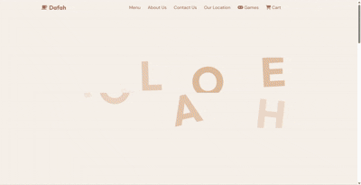
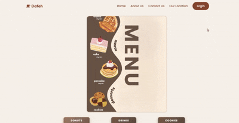

# ☕ Coffee Shop Website

A full coffee shop web application that allows users to browse products, manage a cart, sign up or log in, place orders, and access different pages such as menu, location, contact, games, gift cards, and dashboard.

## 📌 Project Overview

This project is a coffee shop website built using front-end web technologies with backend integration.  
The website includes multiple product categories such as drinks, donuts, and cookies, along with user authentication, cart, checkout, admin dashboard, and database support.

### Home Page Animation


### Menu Page Animation


And many more features...
## ✨ Features

- Responsive coffee shop website
- Home page with navigation
- Menu page for browsing products
- Separate pages for:
  - Drinks
  - Donuts
  - Cookies
- Shopping cart functionality
- Checkout page
- User signup and login
- Forgot password page
- User dashboard
- Admin page
- Contact page
- About page
- Location page with map
- Gift card page
- Games page
- Email marketing script
- SMS notifications script
- Backend API connection
- MySQL database schema included

## 🛠️ Technologies Used

- HTML
- CSS
- JavaScript
- Backend API
- MySQL
## 📁 Project Structure

```text
coffee-shop-website/
├── backend/
├── images/
├── Home_page.html
├── Home_page.css
├── Home_page.js
├── menu.html
├── menu.css
├── Drinks.html
├── Drinks.css
├── Drinks.js
├── donuts.html
├── donuts.css
├── donuts.js
├── Cookies.html
├── Cookies.css
├── Cookies.js
├── cart.html
├── cart.css
├── cart.js
├── checkout.html
├── checkout.css
├── checkout.js
├── login.html
├── login.css
├── login.js
├── signup.html
├── signup.css
├── signup.js
├── forgotpass.html
├── forgotpass.css
├── dashboard.html
├── dashboard.css
├── dashboard.js
├── admin.html
├── admin.css
├── admin.js
├── about.html
├── about.css
├── about.js
├── contact.html
├── contact.css
├── contact.js
├── Location.html
├── Location.css
├── games.html
├── games.css
├── games.js
├── giftcard.html
├── navigation.js
├── api-config.js
├── admin-api.js
├── auth-middleware.js
├── database.sql
├── emailmarketing.js
├── smsnotifications.js
├── jquery.js
└── README.md
```

## 🚀 How to Run the Project

1. Clone the repository:

```bash
git clone https://github.com/danathul/webdf.git
```

2. Open the project folder:

```bash
cd webdf
```

3. Open the main page in your browser:

```text
Home_page.html
```

4. To use backend features, make sure the backend server is running.

5. Import the database schema from:

```text
database.sql
```

## 🗄️ Database

The project includes a MySQL database file:

```text
database.sql
```

This file contains the database schema required for the backend features, including user accounts, products, orders, and other website data.

## 🔗 API Integration

Several pages are connected to the backend API, including:

* Drinks page
* Donuts page
* Cookies page
* About page
* Contact page
* Dashboard page
* Games page
* Signup page

The API configuration can be found in:

```text
api-config.js
```

## 👤 User Pages

The website supports user-related functionality such as:

* Login
* Signup
* Forgot password
* Dashboard
* Cart
* Checkout

## 🛠️ Admin Panel

The project includes an admin page for managing website data.

Admin-related files:

```text
admin.html
admin.css
admin.js
admin-api.js
```
## 🎯 Purpose of the Project

The purpose of this project is to build a complete coffee shop website that combines front-end design with backend functionality.
It helps practice HTML, CSS, JavaScript, API integration, authentication, cart management, checkout flow, and database usage.

## 👨‍💻 Author

Created by Farah Rabi and Dana thul

## 📄 License

This project is for educational purposes.

